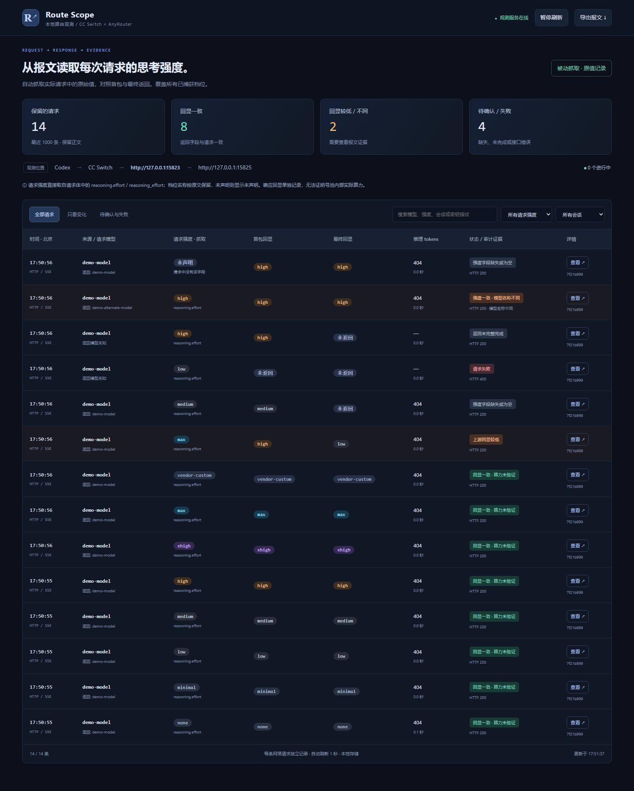

# Route Scope

本地 CC Switch / AnyRouter 请求与响应观测工具，提供中文面板、Windows / WSL 自动旁路抓取、显式反向代理，以及可选的强度回显核验网关。

[](https://github.com/Niyu24-Hub/route-scope/actions/workflows/tests.yml)
[](LICENSE)

**[完整入门教程](docs/QUICKSTART.md) · [下载版本](https://github.com/Niyu24-Hub/route-scope/releases) · [常见问题](docs/TROUBLESHOOTING.md) · [更新记录](CHANGELOG.md)**



截图为模拟数据。项目记录观测点上的实际请求与返回；模型名、强度回显和 tokens 都是协议证据，不能证明号池内部真实模型、账号或计算资源。

## 快速体验

要求 Python 3.11+。下载源码 ZIP 并解压，Windows 双击 **start-demo.cmd**，等待生成演示记录，打开 <http://127.0.0.1:15824>。首次运行需要网络安装依赖；演示不需要 API Key。

或者在终端安装：

```bash
git clone https://github.com/Niyu24-Hub/route-scope.git
cd route-scope
python -m venv .venv
# Windows: .venv\Scripts\activate
# Linux / WSL: source .venv/bin/activate
python -m pip install -e .
python -m route_scope demo
```

Windows 与 WSL 共用源码时，分别创建环境，不能共用 `.venv`。按 Ctrl+C 停止演示。

## 选择模式

| 模式 | 启动 | 默认面板 | 适用场景 |
|---|---|---|---|
| 本地演示 | `python -m route_scope demo` | 15824 | 无 Key 体验模拟数据 |
| 自动旁路 | `start-auto.cmd` / `python -m route_scope watch` | 15927 | 保持原链路，观察客户端与 CC Switch 间的请求 |
| 显式代理 | `python -m route_scope serve` | 15724 | CC Switch 上游设为 `http://127.0.0.1:15723/v1` |
| 回显网关 | `python -m route_scope serve --config guard.local.toml` | 15726 | 授权路由选择、出站门槛与最终回显核验 |
| 网关演示 | `python -m route_scope guard-demo` | 15834 | 无 Key 体验合格与拒绝行为 |

自动旁路：Windows 需要可用的 Npcap 回环接口；Linux / WSL 需要 root 或抓包权限。它只能解析 IPv4 本机 HTTP/1.x，不能解密 TLS，也不支持旁路 HTTP/2 / WebSocket。

显式代理：不需要驱动或根证书。将供应商 base_url 指向本地代理，并保持真正的上游根地址；不要指回 CC Switch。停止前恢复供应商原地址。

网关：先复制 `guard.example.toml` 为 `guard.local.toml`，填写实际模型与路由。完整返回通过核验才交付，因此增加首字等待；缺失回显会拒绝。默认只尝试一次，不保证上游真实算力。

## 功能与边界

- 分别提取请求强度、首包和最终回显，保留缺失、null、未知字符串和 0 tokens。
- Claude 专项：展示 thinking 模式/预算、消息级 effort 与 thinking tokens；标准协议无回显时单独显示完成状态。[字段说明与截图](docs/CLAUDE-CAPTURE.md)
- 支持 Responses、Chat Completions、Claude Messages 的 HTTP / SSE 观测，支持 gzip / deflate / br / zstd；显式代理支持顺序 WebSocket Responses。
- 会话筛选、来源覆盖、完整性状态、脱敏报文详情、JSONL 导出。
- Windows / WSL 各自存储，通过原子快照聚合，来源故障与读取错误会显示在面板中。
- 默认保留最近 1000 条，每侧正文最多 2 MiB；超限明确标记截断。认证头与常见凭据会脱敏，代码和提示词仍可能敏感。
- 使用 `--metadata-only` 可避免保存新正文；数据保存在本机。不要将面板转发到公网，详见 [安全说明](SECURITY.md)。

## 文档

- [从零开始：安装、体验、真实接入、恢复与升级](docs/QUICKSTART.md)
- [自动抓取与多来源数据](docs/AUTO-CAPTURE.md)
- [Windows 捕获诊断](docs/WINDOWS-MODERN-CAPTURE.md)
- [WSL 限时旁路观测](docs/PASSIVE-WSL.md)
- [强度回显网关](docs/ROUTING-GUARD.md)
- [Claude 抓取：thinking 用量与无回显语义](docs/CLAUDE-CAPTURE.md)
- [mitmproxy 可选适配器](docs/MITMPROXY.md)
- [验证记录](docs/VALIDATION.md) · [开发贡献](CONTRIBUTING.md) · [发布流程](docs/RELEASING.md)
- [架构图](docs/architecture.svg)与 [DOT 源文件](docs/architecture.dot)

## 开发

```bash
python -m pip install -e ".[dev]"
python -m pytest -q
```

前端无需 Node 构建。基础测试使用本地模拟流量；Windows / Ubuntu 的 Python 3.11 / 3.12 由 GitHub Actions 验证。可选 mitmproxy 适配器要求 Python 3.12+。

本项目与 CC Switch、AnyRouter、OpenAI、Anthropic 无隶属关系。MIT 许可证；依赖遵循各自许可证，分发包不包含 Npcap、账号或密钥。

## 社区友链

- [LINUX DO 社区](https://linux.do)
