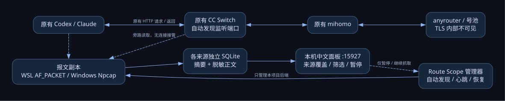

# 自动抓取使用说明

## 日常使用

Windows 双击项目目录的 **start-auto.cmd**。它启动本项目的管理器、捕获后端和中文面板，随后正常使用 Codex / Claude 即可。默认面板为 [http://127.0.0.1:15927](http://127.0.0.1:15927)。重复双击会在已有服务心跳正常时直接打开面板。

保持启动窗口运行；按 Ctrl+C 或运行 **stop-auto.cmd**，只会通知本项目的捕获后端退出。界面中的“暂停抓取”暂停收集，原应用和原网络链路继续运行；“暂停刷新”只暂停表格刷新，两者不同。恢复抓取后从新的完整请求开始观察，暂停期间的数据无法补回。

没有安装开机启动项。这里的“自动”指启动后自动发现并持续抓取；需要开机自启时再单独配置。

## 自动发现与捕获覆盖

| 来源 | 自动发现内容 | 要求与边界 |
|---|---|---|
| WSL / Linux | CC Switch 进程、该进程实际持有的监听端口、Codex/Claude 进程、实际有流量的接口 | 使用 AF_PACKET，只读取报文副本，需要 root/CAP_NET_RAW；Windows 启动器以 WSL root 启动自己的捕获子进程 |
| Windows 本机 | CC Switch 进程和其监听端口 | 使用已安装驱动的 Npcap 回环接口；没有接口或权限不足时明确显示不可用，不安装/替换驱动 |
| 面板 | 聚合各来源最近记录、心跳、端口、请求数、丢包与解析错误 | 各后端独立数据库；跨系统面板只读 JSON 快照，不读取 WSL 活跃 WAL；某来源不可用不妨碍其他来源 |

Windows 后端使用端口 BPF 过滤、8 MiB 缓冲区和非阻塞进程发现；丢包时受影响记录标记为不完整。端口以本机实际发现结果为准。

WSL 会同时接收各网络接口的报文，仅保留目标 CC Switch 本机端口的 IPv4 回环 TCP 数据；接口名称由实际收到的报文确定。因此普通 lo 和 WSL mirrored 的 loopback0 无需手工切换。重复副本和 TCP 重传按序号去重。

CC Switch 没启动时显示“等待 CC Switch 启动”。它之后启动或换端口，后端下一次扫描会自动跟随。WSL 约每 5 秒扫描，Windows 约每 8 秒扫描。应用 PID 不作为永久配置写死。

## 命令行

Windows：

```powershell
cd route-scope
.\.venv\Scripts\python.exe -m route_scope watch
# 只观察指定 WSL，面板换端口，不保存正文：
.\.venv\Scripts\python.exe -m route_scope watch --distro Ubuntu --wsl-only --dashboard-port 15928 --metadata-only --data-dir data/auto-private
# 查看状态 / 停止自己的服务：
.\.venv\Scripts\python.exe -m route_scope watch-status
.\.venv\Scripts\python.exe -m route_scope watch-stop
```

WSL：

```bash
cd /path/to/route-scope
bash start-auto-wsl.sh
```

WSL 启动脚本使用用户环境中的 Python；原生 WSL 启动可能需要 sudo。Windows 启动器自动寻找现有 Route Scope 环境；没有可用环境时只在用户目录创建隔离 Python 环境，不替换系统 Python。默认发现所有非 Docker WSL 发行版；可用 `--distro Ubuntu` 限定一个。发行版未运行时，Windows 启动器会启动该发行版来运行自己的捕获进程，不会终止或重启已运行发行版。

`--port 15722` 可额外观察指定本机端口；默认只发现 CC Switch 自己持有的监听端口。`--retention 1000` 控制每个来源保留条数，统一面板最多列出同样数量的最新记录。指定不同 `--data-dir` 时，停止命令也必须指定相同目录。

## 原进程不受接管

自动模式不会：修改 base_url、修改 CC Switch 数据库、改变 Codex/Claude 的思考强度、修改系统/应用代理或防火墙、安装证书、向原进程发送输入或暂停/终止信号、主动调用 anyrouter 做题或重试。

捕获的“请求强度”来自 **客户端 → CC Switch** 的真实请求 body，响应强度来自 **CC Switch → 客户端** 的真实返回。此模式不能证明 CC Switch 实际发给 anyrouter 的 TLS 内部报文是什么，更不能认证号池的真实算力。所有档位字符串均原样保留，缺失/null 与正常值分开。

启动时已经传输到中途的连接，可能只有响应没有请求，统计中会记录这类情况，不拼凑请求或猜测强度。协议解析目前限于 IPv4 本机 HTTP/1.x（包括 SSE、chunked 和压缩 body）；HTTP/2、TLS 和 WebSocket 旁路解析不支持，无法解析时显示错误/未知。主程序的显式反向代理仍提供顺序 WebSocket 观测。

## 状态、恢复与数据

- 管理器每秒更新心跳；后端约每 2 秒更新端口、真实接口、抓取数量和异常。界面明确区分服务在线、等待监听、等待流量、抓取中、暂停、不可用和心跳中断。
- 后端异常退出，管理器只重启自己的后端；后端检查管理器租约，管理器消失或被新实例替换时自行退出。硬退出后的租约失效窗口最长约 90 秒。
- 每个管理目录和来源目录均有单实例锁，避免重复写入和重复捕获。来源发生故障会保留已写入记录，未完整捕获的请求标为中断，不标为模型失败。
- TCP 连接在 response.completed 后重置时，业务完成事件和 HTTP 结束完整性分别保存；抓取窗口停止也不等于上游失败。
- 默认保留脱敏正文，每侧前 2 MiB；开启 `--metadata-only` 不落正文。列表读取独立摘要，点击详情或导出才读取正文。SQLite 旧记录会自动迁移为带摘要结构，保留原报文。
- `data/auto/watch-status.json` 是管理器状态，`control.json` 是本项目的暂停/停止标记；各 `windows` / `wsl-*` 子目录发布 `capture-index.json`、`records/` 脱敏详情、`capture-status.json` 与受大小限制的工作日志。Windows 自己的数据库仍在来源目录；WSL 数据库保存在 Linux 本地 `~/.local/share/route-scope/storage/`，准确位置见该来源的 `storage.json`。旧共享盘数据库作为迁移前原件保留，不再更新。
- 正文虽已遮盖认证头与常见凭据，仍可能包含工作代码和提示词。所有数据只写本机；不上传报文、不保存未脱敏 PCAP。

## 实现结构



保留 [DOT 源文件](auto-architecture.dot)。`watch.py` 管理自己的后端生命周期，`autocapture.py` 负责持续接收，`discovery.py` 只读发现进程/端口，`packet_sources.py` 适配现有捕获能力，`catalog.py` 只读聚合各来源数据库。

### 0.3.1：修复后端有请求、面板显示 0

Windows 不再读取 WSL 正在写入的 SQLite WAL/SHM。后端先在自己的系统内提交数据库，再原子发布脱敏详情和摘要索引，面板仅读取快照。发布或读取失败时明确告警并保留上次成功列表，不再静默显示空列表。历史数据库迁移使用 SQLite backup API，并检查完整性、保留原件。
