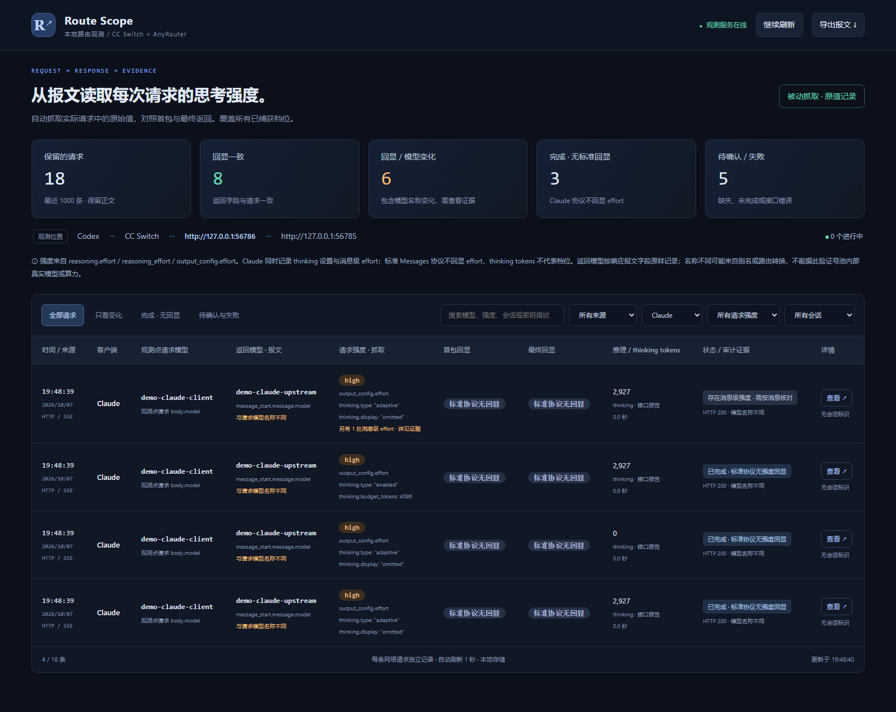

# Claude：请求强度、thinking 用量与完成状态

自 0.3.3 起，Route Scope 按 Messages 协议展示 Claude 证据。不会因为标准响应没有 effort 回显就认定抓取失败，也不会从 thinking tokens 推测 high / low。

## 面板上能看到什么

| 项目 | 原始字段 | 解释 |
|---|---|---|
| 观测点请求模型 | 请求 `model` | 旁路模式是客户端发给 CC Switch 的模型名，不代表 CC Switch 映射后的上游模型 |
| 返回模型 | `message_start.message.model` 或 JSON 响应 `model` | 响应声明名称；不认证底层真实模型 |
| 顶层请求强度 | `output_config.effort` | 保留原始字符串、null 与未声明 |
| 思考模式与设置 | `thinking.type`、`thinking.budget_tokens`、`thinking.display` | 在请求强度列显示；预算、展示开关与 effort 分开保存 |
| 消息级强度 | `messages[i].output_config.effort` | 记录索引、role、值与字段路径；详情中可核对，不擅自计算最终有效档位 |
| thinking 用量 | `usage.output_tokens_details.thinking_tokens` | 接口报告的内部推理用量；0 与未提供不同，不等于可见摘要长度 |
| 完成状态 | `message_delta.delta.stop_reason` + `message_stop` | 缺失结束事件、`max_tokens`、错误与正常完成分开处理 |

标准 Messages 响应没有要求服务端回显已接受或实际执行的 effort。正常结束且无回显时显示 **“已完成 · 标准协议无强度回显”**，归入独立统计及“完成 · 无回显”筛选，不计入“回显一致”或“待确认与失败”。模型名变化仍单独提示。

如果发现消息级 effort，面板保留顶层值并提示查看消息设置，状态为“存在消息级强度 · 需按消息核对”。并非所有模型或 API 版本都接受消息级设置；捕获到字段不等于上游支持它。官方 SDK 当前将消息级 `output_config` 定义在 system 消息上；对非标准 role，项目仍保留原文证据，不伪装成已生效。

供应商若返回非标准 effort 扩展，会原样显示并标注“供应商扩展回显”。最终事件或 `message_delta` 中明确出现的值可用于比较；不会用首包值填补缺失的最终值。回显 null 仍是明确空值，不按“没有该字段”处理。

## 用量处理

流式 usage 是累计用量。项目合并 `message_start` 和 `message_delta` 的字段，更新同名值而不累加计数；后续事件只给 `output_tokens` 时不会丢掉先前的 thinking 明细。

导出保留完整脱敏 `usage`，并增加 `thinking_tokens`、`reasoning_tokens_source`。现有通用表格字段 `reasoning_tokens` 对 Claude 优先显示 thinking 用量，来源路径明确记录；OpenAI Responses / Chat 的 reasoning 字段优先级不变。无效用量值保留在原始 usage 中，数值列不强制转换。

仅元数据模式也会保留请求的 thinking 设置与用量，不保存提示词或回答正文。`thinking.display=omitted` 不代表没有思考；总输出上限 `max_tokens` 也不等于 thinking 预算。

## 旧记录与升级

数据库及快照中的旧 Claude 记录，只要保存了 usage，读取时即可补充显示 thinking 用量与协议状态。过程不改写原始报文或哈希。旧摘要未提取的 thinking 请求设置会注明未记录；详情仅在旧请求正文仍存在时补充，不从模型名或响应内容猜测。

先正常停止本项目，再更新并安装依赖，重新启动对应捕获器和面板，参见 [升级教程](QUICKSTART.md)。不需要清空历史数据。未重启的捕获进程仍运行旧代码。

## 本地演示

运行 `python -m route_scope demo`，打开 <http://127.0.0.1:15824>，按客户端筛选 Claude。18 条模拟记录中包含 4 条 Claude 示例：adaptive、0 thinking tokens、手动预算、消息级 effort。全部使用模拟模型和本地响应。

## 官方依据与边界

- [Messages 响应类型](https://github.com/anthropics/anthropic-sdk-python/blob/main/src/anthropic/types/message.py)
- [Beta thinking token 字段](https://github.com/anthropics/anthropic-sdk-python/blob/main/src/anthropic/types/beta/beta_output_tokens_details.py)
- [Beta 消息配置](https://github.com/anthropics/anthropic-sdk-python/blob/main/src/anthropic/types/beta/beta_message_param.py)与[消息级 effort 定义](https://github.com/anthropics/anthropic-sdk-python/blob/main/src/anthropic/types/beta/beta_system_message_output_config_param.py)

字段支持依赖实际模型、API 版本与供应商。第三方的模型名称、effort 或 usage 不是可信的算力证明。自动旁路仍只观测客户端 ⇄ CC Switch；未捕获的上游 TLS 报文不能由配置值替代。
